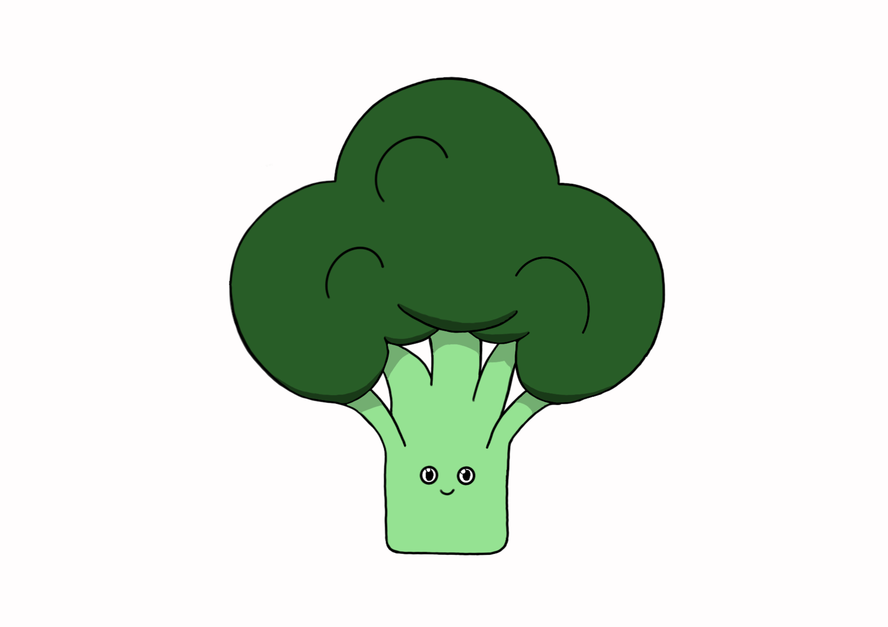

# La Popoterie

Welcome to the repository of the La Popoterie mobile application! 🌱📱

## Project Overview

La Popoterie is a mobile application developed by two engineering students, Cassandre and Arthur. The project aims to provide tasty recipes using local and seasonal ingredients, specifically designed for vegetarian students who care about the environment.

## Key Features

- 🍽 Vegetarian and vegan recipes
- 🌍 Use of local and seasonal produce
- 💸 Budget-friendly solutions for students
- 📲 User-friendly interface